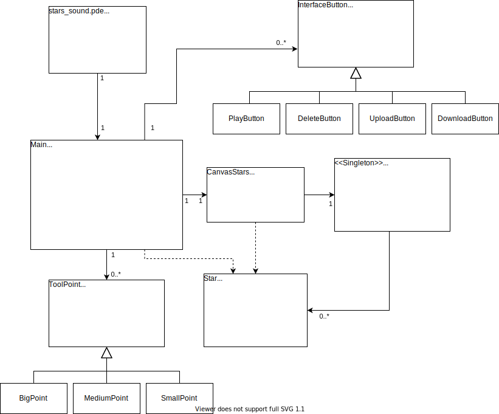

# Stars Sound
Stars Sound es una aplicación que permite a los usuarios crear sus propias constelaciones para posteriormente convertir éstas en melodías musicales. Además de esto ofrece otras opciones, tales como la personalización del fondo de la pantalla o la descarga de un archivo con el código necesario para su reproducción.
La aplicación se ha desarrollado utilizando Processing, donde ha sido necesaria la instalación de varias librerías para poder realizar las diferentes funciones de la app. Así mismo, la reproducción de las melodías se lleva a cabo a través de Sonic Pi mediante la creación de código Ruby. 

### Diagrama de clases UML

